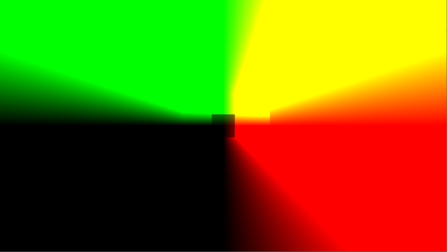
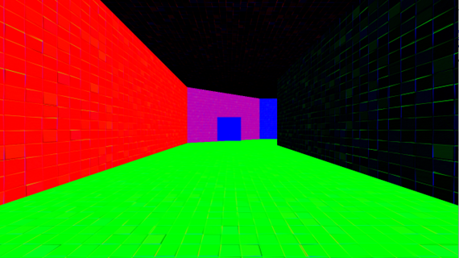
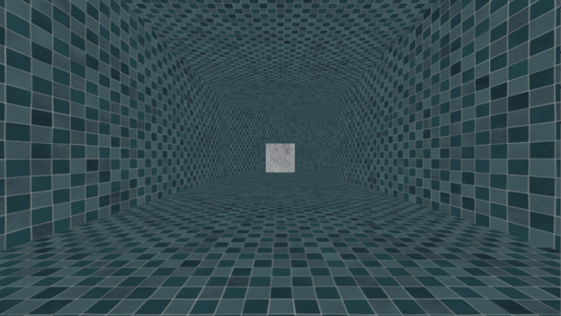
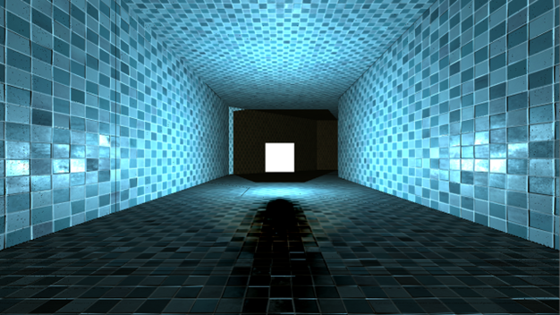
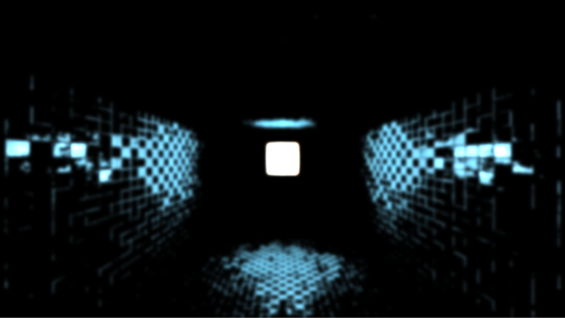
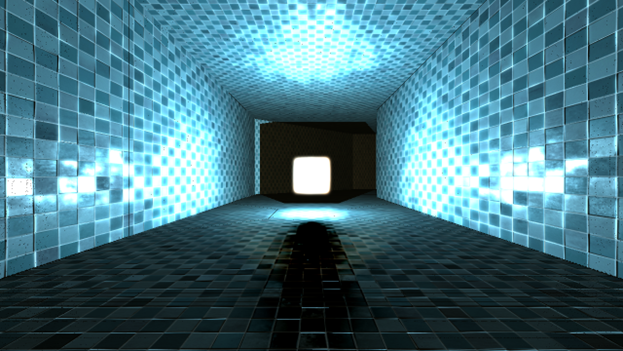

# WE Call It Engine

_This repository contains the source code, and assets of my university project "WE Call it Engine". Feel free to use any parts of it as you wish, if you find it to be useful._

The engine has the following features:

* Physically-based rendering (PBR)
* Point light, and spot light shadow mapping
* Deferred rendering pipeline
* Post-processing effects, such as bloom

## Images

_This is how the different stages of the so-called "G-Buffer" of the deferred rendering pipeline look like during a draw call:_

* `COLOR_ATTACHMENT0` contains _world position_ of all pixels on the screen:

* `COLOR_ATTACHMENT1` contains _world normal vectors_ of all pixels on the screen:

* `COLOR_ATTACHMENT2` contains the _diffuse component_ of the material in the RGB channels, and the "metallic" value in the alpha channel of all pixels on the screen:

* Combining all of these together, and applying shadow mapping produces a "raw lit image":

* To apply the bloom post-processing effect, we apply threholding to this sub-result, and apply a gaussian blur to this thresholded image:

* Finally, we compose the complete image using the "raw lit image", and the blurred "bloom image":

